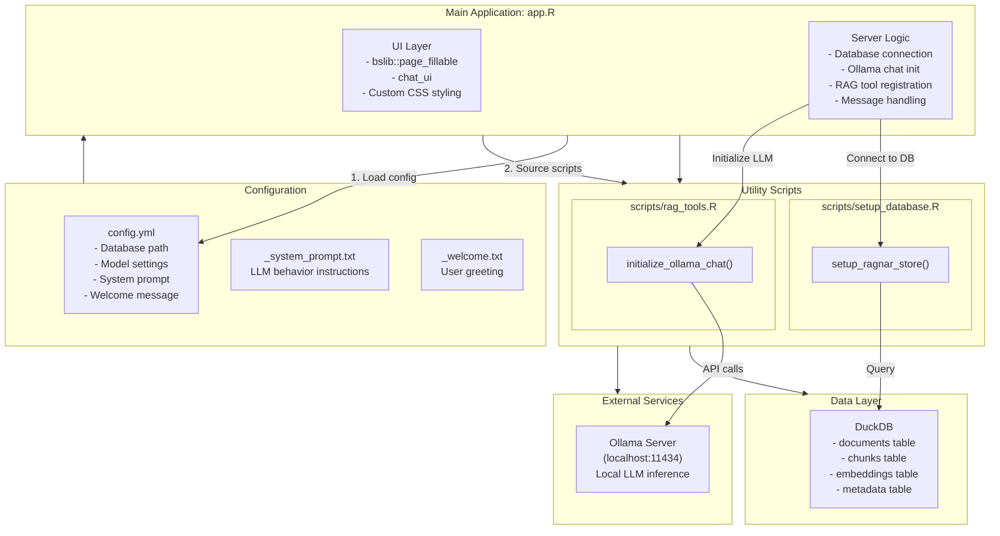
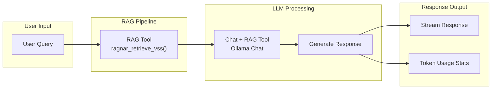
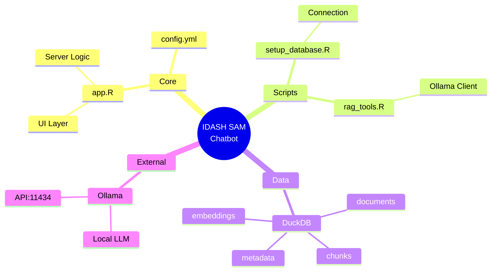

## App components

```mermaid
flowchart TB
    subgraph App["Main Application: app.R"]
        direction TB
        UI["UI Layer<br/>- bslib::page_fillable<br/>- chat_ui<br/>- Custom CSS styling"]
        Server["Server Logic<br/>- Database connection<br/>- Ollama chat init<br/>- RAG tool registration<br/>- Message handling"]
    end

    subgraph Config["Configuration"]
        config_yml["config.yml<br/>- Database path<br/>- Model settings<br/>- System prompt<br/>- Welcome message"]
        sys_prompt["_system_prompt.txt<br/>LLM behavior instructions"]
        welcome["_welcome.txt<br/>User greeting"]
    end

    subgraph Scripts["Utility Scripts"]
        subgraph DB["scripts/setup_database.R"]
            db_setup["setup_ragnar_store()"]
        end
        
        subgraph RAG["scripts/rag_tools.R"]
            ollama_init["initialize_ollama_chat()"]
        end
    end

    subgraph Data["Data Layer"]
        duckdb["DuckDB<br/>- documents table<br/>- chunks table<br/>- embeddings table<br/>- metadata table"]
    end

    subgraph External["External Services"]
        ollama["Ollama Server<br/>(localhost:11434)<br/>Local LLM inference"]
    end

    %% Connections
    Config --> App
    App --> Scripts
    Scripts --> Data
    Scripts --> External
    
    App -->|1. Load config| config_yml
    App -->|2. Source scripts| Scripts
    Server -->|Connect to DB| db_setup
    Server -->|Initialize LLM| ollama_init
    db_setup -->|Query| duckdb
    ollama_init -->|API calls| ollama
```

## Flow of query and response

```mermaid
flowchart LR
    subgraph Input["User Input"]
        query["User Query"]
    end
    
    subgraph Processing["RAG Pipeline"]
        direction TB
        retrieve["RAG Tool<br/>ragnar_retrieve_vss()"]
    end
    
    subgraph LLM["LLM Processing"]
        chat["Chat + RAG Tool<br/>Ollama Chat"]
        generate["Generate Response"]
    end
    
    subgraph Output["Response Output"]
        response["Stream Response"]
        token_stats["Token Usage Stats"]
    end
    
    query --> retrieve
    retrieve --> chat
    chat --> generate
    generate --> response
    generate --> token_stats
```

## General app organization

```mermaid
mindmap
  root((IDASH SAM<br/>Chatbot))
    Core
      app.R
        UI Layer
        Server Logic
      config.yml
    Scripts
      setup_database.R
        Connection
      rag_tools.R
        Ollama Client
    Data
      DuckDB
        documents
        chunks
        embeddings
        metadata
    External
      Ollama
        Local LLM
        API:11434
```
